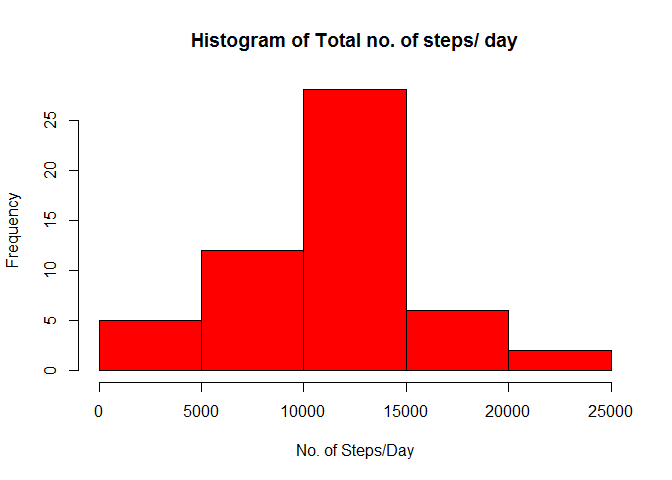
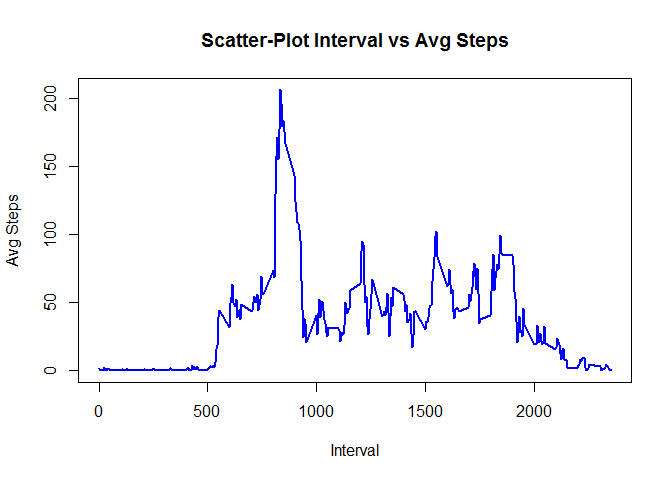
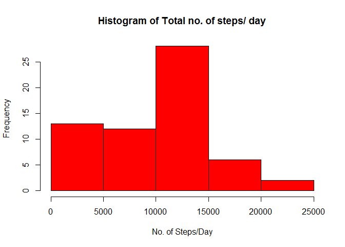
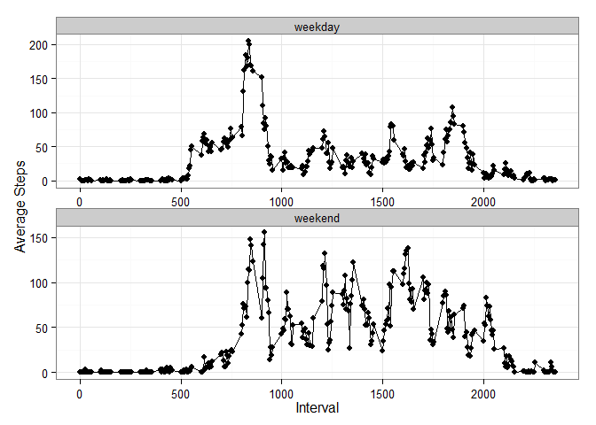

# Reproducible Research: Peer Assessment 1


## Loading and preprocessing the data

We will loading the data using read.csv function and convert the date variable to date format by as.Date() function.  


```r
activity_data = read.csv('activity.csv')
activity_data$date = as.Date(activity_data$date,'%Y-%m-%d') 
```

## What is mean total number of steps taken per day?

We first removed the na values from the data frame and calculate total no. of steps in a day by aggregating step values using aggregate() 

```r
activity_data_nonNA = activity_data[!is.na(activity_data$steps),]
activity_data_day = with(activity_data_nonNA, aggregate(steps, list(date),sum))
colnames(activity_data_day) = c('Day','Total_steps')
```

The histogram and mean/median steps are calculated from aggregated data 

```r
hist(activity_data_day$Total_steps,ylab = 'Frequency',xlab = 'No. of Steps/Day',main = 'Histogram of Total no. of steps/ day',col = 'red')
```

 

```r
mean_steps = format(mean(activity_data_day$Total_steps),scientific = F)
median_steps = median(activity_data_day$Total_steps)
```
The mean total steps per day was **10766.19** and median total steps per day was **10765**

## What is the average daily activity pattern?

For average daily activity pattern, we aggregated the data on interval averaged across all dates and calculated mean of steps. Scatter plot is shown below for interval (x-axis) and average no. of steps on that interval over all days. 


```r
activity_interval_avg = data.frame(with(activity_data_nonNA,aggregate(steps,list(interval),mean)))
colnames(activity_interval_avg) = c('Interval_id','Mean_steps')
with(activity_interval_avg,plot(Interval_id,Mean_steps,type = 'l',xlab = 'Interval',ylab = 'Avg Steps',main = 'Scatter-Plot Interval vs Avg Steps',lwd = 2,col = 'blue'))
```

 

```r
max_interval = activity_interval_avg[which(activity_interval_avg$Mean_steps == max(activity_interval_avg$Mean_steps)),]$Interval_id
```
The interval **835** on average has maximum average no. of steps. 


## Imputing missing values

```r
library(data.table)
Total_MV = nrow(activity_data) - nrow(activity_data_nonNA)
activity_table = data.table(activity_data)
activity_table[,steps_fill := ifelse(is.na(steps),median(steps,na.rm = T),steps), by = interval]
```

```
##        steps       date interval steps_fill
##     1:    NA 2012-10-01        0          0
##     2:    NA 2012-10-01        5          0
##     3:    NA 2012-10-01       10          0
##     4:    NA 2012-10-01       15          0
##     5:    NA 2012-10-01       20          0
##    ---                                     
## 17564:    NA 2012-11-30     2335          0
## 17565:    NA 2012-11-30     2340          0
## 17566:    NA 2012-11-30     2345          0
## 17567:    NA 2012-11-30     2350          0
## 17568:    NA 2012-11-30     2355          0
```
The total number of missing values can be found out by subtracting the two datasets which is **2304**. Using data.table function, new variable steps_fill is made which replace NA with median of steps taking in same interval across different dates. 
The new dataset create is activity_table. The new data frame is create which sums the steps by date. 


```r
activity_day_fill = activity_table[, list(Total_steps = sum(steps_fill)),by = list(date)]
mean_fill = round(mean(activity_day_fill$Total_steps),2)
median_fill = median(activity_day_fill$Total_steps)
hist(activity_day_fill$Total_steps,ylab = 'Frequency',xlab = 'No. of Steps/Day',main = 'Histogram of Total no. of steps/ day',col = 'red')
```

 

The mean total no. of steps after filling missing value is **9503.87** and median is **10395**. These values are lower than first part when we removed NA values from the analysis. 


## Are there differences in activity patterns between weekdays and weekends?

Creating a new factor variable weekday by ifelse function in R. 


```r
library(ggplot2)
off = c('Saturday','Sunday')
activity_table[, weekday := ifelse(weekdays(date) %in% off,'weekend','weekday')]
```

```
##        steps       date interval steps_fill weekday
##     1:    NA 2012-10-01        0          0 weekday
##     2:    NA 2012-10-01        5          0 weekday
##     3:    NA 2012-10-01       10          0 weekday
##     4:    NA 2012-10-01       15          0 weekday
##     5:    NA 2012-10-01       20          0 weekday
##    ---                                             
## 17564:    NA 2012-11-30     2335          0 weekday
## 17565:    NA 2012-11-30     2340          0 weekday
## 17566:    NA 2012-11-30     2345          0 weekday
## 17567:    NA 2012-11-30     2350          0 weekday
## 17568:    NA 2012-11-30     2355          0 weekday
```

```r
activity_table[,weekday := as.factor(weekday)]
```

```
##        steps       date interval steps_fill weekday
##     1:    NA 2012-10-01        0          0 weekday
##     2:    NA 2012-10-01        5          0 weekday
##     3:    NA 2012-10-01       10          0 weekday
##     4:    NA 2012-10-01       15          0 weekday
##     5:    NA 2012-10-01       20          0 weekday
##    ---                                             
## 17564:    NA 2012-11-30     2335          0 weekday
## 17565:    NA 2012-11-30     2340          0 weekday
## 17566:    NA 2012-11-30     2345          0 weekday
## 17567:    NA 2012-11-30     2350          0 weekday
## 17568:    NA 2012-11-30     2355          0 weekday
```

```r
avg_activity = activity_table[,list(Avg_step = mean(steps_fill)) , by = list(interval,weekday)]
p = ggplot(data = avg_activity, aes(x = interval,y = Avg_step)) + geom_point() + geom_line() + facet_wrap(~weekday,ncol=1,scale='free') + theme_bw() +xlab('Interval') + ylab('Average Steps') 
print(p)
```

 
